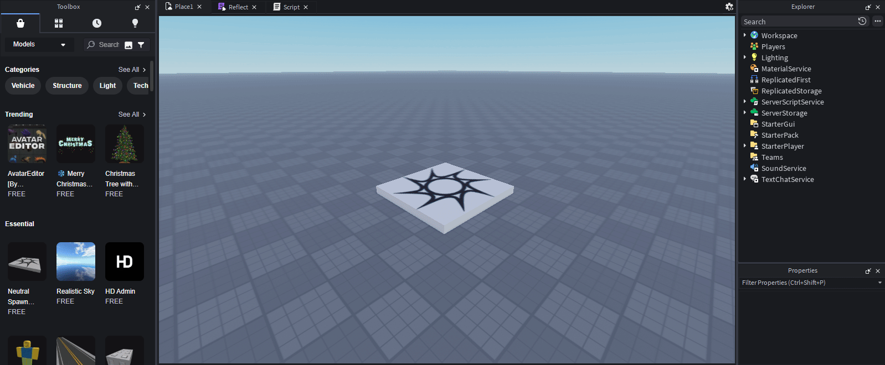

# Roblox reflect library
## This was made with [dump-roblox-api](https://github.com/bob448/dump-roblox-api)

## How to setup:
Copy and paste Reflect.lua into a ModuleScript.
You should preferably name it "Reflect" or something similar,
and you should put it into `ReplicatedStorage`



Then, you can use `require()` to load it into a `Script` or `LocalScript`:

```lua
local ReplicatedStorage = game:GetService("ReplicatedStorage")

local reflect = require(ReplicatedStorage:WaitForChild("Reflect"))
```

# Flattened version:
I am not responsible for any exploiter's actions when using this code.

```lua
local reflect = loadstring(game:HttpGet("https://raw.githubusercontent.com/bob448/roblox-reflect/main/src/Reflect.lua"))()
```

# Examples:
## [ReplicatedStorage-info.lua](examples/ReplicatedStorage-info.lua)
```
  ReplicatedStorage:
  	- Member: ClassName
  	- Value: ReplicatedStorage
  		- Category: Data
  		- MemberType: Property
  		- ValueType:
  			- Name: string
  			- Category: Primitive
  	- Member: DataCost
  		- Category: Data
  		- MemberType: Property
  		- ValueType:
  			- Name: int
  			- Category: Primitive
  	- Member: Name
  	- Value: ReplicatedStorage
  		- Category: Data
  		- MemberType: Property
  		- ValueType:
  			- Name: string
  			- Category: Primitive
  	- Member: Parent
  	- Value: Game
  		- Category: Data
  		- MemberType: Property
  		- ValueType:
  			- Name: Instance
  			- Category: Class
  	- Member: RobloxLocked
  		- Category: Data
  		- MemberType: Property
  		- ValueType:
  			- Name: bool
  			- Category: Primitive
  	- Member: SourceAssetId
  		- Category: Data
  		- MemberType: Property
  		- ValueType:
  			- Name: int64
  			- Category: Primitive
  	- Member: archivable
  	- Value: true
  		- Category: Behavior
  		- MemberType: Property
  		- ValueType:
  			- Name: bool
  			- Category: Primitive
  	- Member: className
  	- Value: ReplicatedStorage
  		- Category: Data
  		- MemberType: Property
  		- ValueType:
  			- Name: string
  			- Category: Primitive
  	- Member: AddTag
  	- Value: function: 0xb5eea967c08d7805
  		- Category: 
  		- MemberType: Function
  		- ValueType:
  			- Name: 
  			- Category: 
  	- Member: ClearAllChildren
  	- Value: function: 0x1a95ffef4e5bf6c5
  		- Category: 
  		- MemberType: Function
  		- ValueType:
  			- Name: 
  			- Category: 
  	- Member: Clone
  	- Value: function: 0x78b8a436c4326585
  		- Category: 
  		- MemberType: Function
  		- ValueType:
  			- Name: 
  			- Category: 
  	- Member: Destroy
  	- Value: function: 0x699fa29cbaeec845
  		- Category: 
  		- MemberType: Function
  		- ValueType:
  			- Name: 
  			- Category: 
  	- Member: FindFirstAncestor
  	- Value: function: 0xac8363054fe68f05
  		- Category: 
  		- MemberType: Function
  		- ValueType:
  			- Name: 
  			- Category: 
  	- Member: FindFirstAncestorOfClass
  	- Value: function: 0x738ac6681654bc05
  		- Category: 
  		- MemberType: Function
  		- ValueType:
  			- Name: 
  			- Category: 
  	- Member: FindFirstAncestorWhichIsA
  	- Value: function: 0x379012dadc0ded05
  		- Category: 
  		- MemberType: Function
  		- ValueType:
  			- Name: 
  			- Category: 
  	- Member: FindFirstChild
  	- Value: function: 0x5db53dbd6e5271c5
  		- Category: 
  		- MemberType: Function
  		- ValueType:
  			- Name: 
  			- Category: 
  	- Member: FindFirstChildOfClass
  	- Value: function: 0x2dbcb548b417d8c5
  		- Category: 
  		- MemberType: Function
  		- ValueType:
  			- Name: 
  			- Category: 
  	- Member: FindFirstChildWhichIsA
  	- Value: function: 0x82a2c626fe420fc5
  		- Category: 
  		- MemberType: Function
  		- ValueType:
  			- Name: 
  			- Category: 
  	- Member: FindFirstDescendant
  	- Value: function: 0xc3e7f87c0c19ac85
  		- Category: 
  		- MemberType: Function
  		- ValueType:
  			- Name: 
  			- Category: 
  	- Member: GetActor
  	- Value: function: 0x016cd5d607b7a945
  		- Category: 
  		- MemberType: Function
  		- ValueType:
  			- Name: 
  			- Category: 
  	- Member: GetAttribute
  	- Value: function: 0x44b152c9f8e90605
  		- Category: 
  		- MemberType: Function
  		- ValueType:
  			- Name: 
  			- Category: 
  	- Member: GetAttributeChangedSignal
  	- Value: function: 0xecb7de27ba7dc705
  		- Category: 
  		- MemberType: Function
  		- ValueType:
  			- Name: 
  			- Category: 
  	- Member: GetAttributes
  	- Value: function: 0x235ce8ffc7976bc5
  		- Category: 
  		- MemberType: Function
  		- ValueType:
  			- Name: 
  			- Category: 
  	- Member: GetChildren
  	- Value: function: 0xa1fe2d574d2ef085
  		- Category: 
  		- MemberType: Function
  		- ValueType:
  			- Name: 
  			- Category: 
  	- Member: GetDebugId
  	- Value: function: 0x9f595348bdfa4d45
  		- Category: 
  		- MemberType: Function
  		- ValueType:
  			- Name: 
  			- Category: 
  	- Member: GetDescendants
  	- Value: function: 0x673470c6c093ea05
  		- Category: 
  		- MemberType: Function
  		- ValueType:
  			- Name: 
  			- Category: 
  	- Member: GetFullName
  	- Value: function: 0x6def4e5d424990c5
  		- Category: 
  		- MemberType: Function
  		- ValueType:
  			- Name: 
  			- Category: 
  	- Member: GetPropertyChangedSignal
  	- Value: function: 0x5d68bad0b19437c5
  		- Category: 
  		- MemberType: Function
  		- ValueType:
  			- Name: 
  			- Category: 
  	- Member: GetTags
  	- Value: function: 0x07e393cf76fbb485
  		- Category: 
  		- MemberType: Function
  		- ValueType:
  			- Name: 
  			- Category: 
  	- Member: HasTag
  	- Value: function: 0x413f7047940d2145
  		- Category: 
  		- MemberType: Function
  		- ValueType:
  			- Name: 
  			- Category: 
  	- Member: IsA
  	- Value: function: 0x851ab6df8e46ce05
  		- Category: 
  		- MemberType: Function
  		- ValueType:
  			- Name: 
  			- Category: 
  	- Member: IsAncestorOf
  	- Value: function: 0xbbf59fb7797f94c5
  		- Category: 
  		- MemberType: Function
  		- ValueType:
  			- Name: 
  			- Category: 
  	- Member: IsDescendantOf
  	- Value: function: 0x1910e96e85562785
  		- Category: 
  		- MemberType: Function
  		- ValueType:
  			- Name: 
  			- Category: 
  	- Member: IsPropertyModified
  	- Value: function: 0xc90baa948f225a45
  		- Category: 
  		- MemberType: Function
  		- ValueType:
  			- Name: 
  			- Category: 
  	- Member: Remove
  	- Value: function: 0x8f069c3d83fa9d05
  		- Category: 
  		- MemberType: Function
  		- ValueType:
  			- Name: 
  			- Category: 
  	- Member: RemoveTag
  	- Value: function: 0xd501618186d161c5
  		- Category: 
  		- MemberType: Function
  		- ValueType:
  			- Name: 
  			- Category: 
  	- Member: ResetPropertyToDefault
  	- Value: function: 0xe51a09ee50ace8c5
  		- Category: 
  		- MemberType: Function
  		- ValueType:
  			- Name: 
  			- Category: 
  	- Member: SetAttribute
  	- Value: function: 0xef373a97f3d30385
  		- Category: 
  		- MemberType: Function
  		- ValueType:
  			- Name: 
  			- Category: 
  	- Member: WaitForChild
  	- Value: function: 0xd710043e34f5d645
  		- Category: 
  		- MemberType: Function
  		- ValueType:
  			- Name: 
  			- Category: 
  	- Member: children
  	- Value: function: 0x3ded018059ce5905
  		- Category: 
  		- MemberType: Function
  		- ValueType:
  			- Name: 
  			- Category: 
  	- Member: clone
  	- Value: function: 0x5326070ec8861dc5
  		- Category: 
  		- MemberType: Function
  		- ValueType:
  			- Name: 
  			- Category: 
  	- Member: destroy
  	- Value: function: 0x73231cb447725e85
  		- Category: 
  		- MemberType: Function
  		- ValueType:
  			- Name: 
  			- Category: 
  	- Member: findFirstChild
  	- Value: function: 0x71fc0a1e432bdb45
  		- Category: 
  		- MemberType: Function
  		- ValueType:
  			- Name: 
  			- Category: 
  	- Member: getChildren
  	- Value: function: 0x17590879c0a10405
  		- Category: 
  		- MemberType: Function
  		- ValueType:
  			- Name: 
  			- Category: 
  	- Member: isA
  	- Value: function: 0xbf321ad241f8d2c5
  		- Category: 
  		- MemberType: Function
  		- ValueType:
  			- Name: 
  			- Category: 
  	- Member: isDescendantOf
  	- Value: function: 0x99cf75c44410a985
  		- Category: 
  		- MemberType: Function
  		- ValueType:
  			- Name: 
  			- Category: 
  	- Member: remove
  	- Value: function: 0xcb48107ace480c45
  		- Category: 
  		- MemberType: Function
  		- ValueType:
  			- Name: 
  			- Category: 
  	- Member: AncestryChanged
  	- Value: Signal AncestryChanged
  		- Category: 
  		- MemberType: Event
  		- ValueType:
  			- Name: 
  			- Category: 
  	- Member: AttributeChanged
  	- Value: Signal AttributeChanged
  		- Category: 
  		- MemberType: Event
  		- ValueType:
  			- Name: 
  			- Category: 
  	- Member: Changed
  	- Value: Signal Changed
  		- Category: 
  		- MemberType: Event
  		- ValueType:
  			- Name: 
  			- Category: 
  	- Member: ChildAdded
  	- Value: Signal ChildAdded
  		- Category: 
  		- MemberType: Event
  		- ValueType:
  			- Name: 
  			- Category: 
  	- Member: ChildRemoved
  	- Value: Signal ChildRemoved
  		- Category: 
  		- MemberType: Event
  		- ValueType:
  			- Name: 
  			- Category: 
  	- Member: DescendantAdded
  	- Value: Signal DescendantAdded
  		- Category: 
  		- MemberType: Event
  		- ValueType:
  			- Name: 
  			- Category: 
  	- Member: DescendantRemoving
  	- Value: Signal DescendantRemoving
  		- Category: 
  		- MemberType: Event
  		- ValueType:
  			- Name: 
  			- Category: 
  	- Member: Destroying
  	- Value: Signal Destroying
  		- Category: 
  		- MemberType: Event
  		- ValueType:
  			- Name: 
  			- Category: 
  	- Member: childAdded
  	- Value: Signal childAdded
  		- Category: 
  		- MemberType: Event
  		- ValueType:
  			- Name: 
  			- Category: 
  	- Member: Archivable
  	- Value: true
  		- Category: Behavior
  		- MemberType: Property
  		- ValueType:
  			- Name: bool
  			- Category: Primitive
```